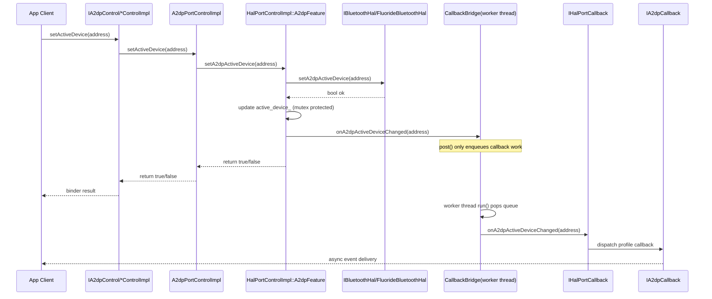
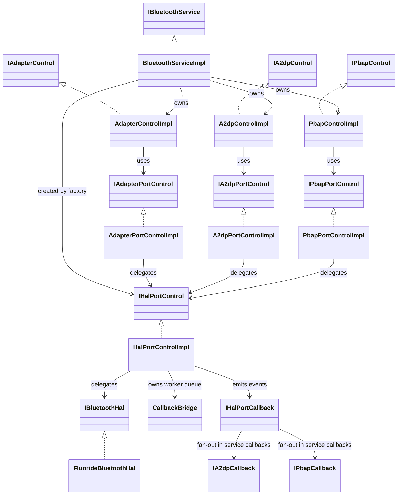
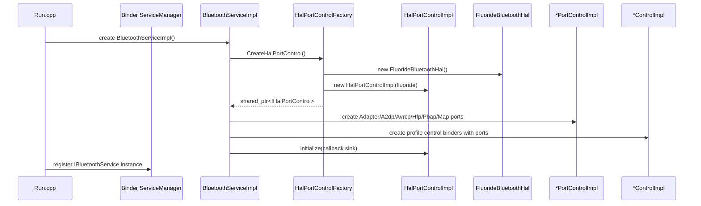
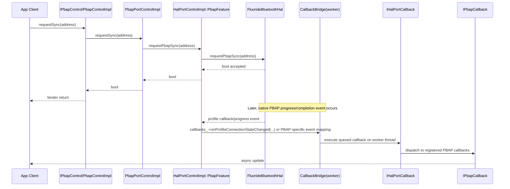
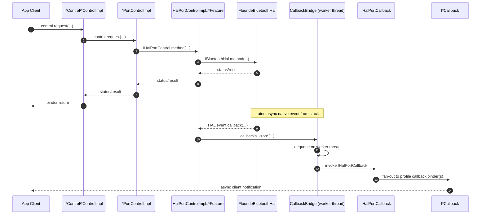

# Bluetooth Architecture Blueprint

This document defines the final Bluetooth architecture for `lobo-aosp-platform` with explicit profile coverage (PBAP, MAP, A2DP, AVRCP, HFP).

---

## What

This architecture standardizes:

- Module boundaries across `client`, `service`, `hal`, and optional shared `interfaces`.
- Explicit profile-oriented structure for Contacts (PBAP), Messages (MAP), Media (A2DP/AVRCP), and Calls (HFP).
- Separation of app/session orchestration from privileged service logic.
- Separation of service policy logic from hardware/device-specific code.

---

## Why

Bluetooth in IVI is cross-cutting and long-lived. A clear split reduces regressions and improves portability across devices (RPi5 now, VIM3 later).

Key reasons:

- Managers and Binder connections are client concerns and should not be hosted in privileged service internals.
- Service process should be authoritative for permissions, global arbitration, and contract stability.
- PBAP/MAP/A2DP/AVRCP/HFP are Android-stack capabilities; vendor layer should orchestrate and expose policy-friendly APIs, not reimplement profile stacks.
- HAL implementation is hardware-dependent and should live under `vendor/lobo/hal`, with service using a stable abstraction.

---

## How

### 1) Final folder structure under `lobo-aosp-platform`

```text
lobo-aosp-platform/
└── vendor/
    └── lobo/
        ├── interfaces/                                # optional, recommended for stable shared IPC
        │   └── bluetooth/
        │       └── aidl/src/com/lobo/platform/bluetooth/
        │           ├── IBluetoothService.aidl
        │           ├── IBluetoothCallback.aidl
        │           ├── BtDevice.aidl
        │           ├── PairingState.aidl
        │           └── ConnectionState.aidl
        │
        ├── client/
        │   └── bluetooth/
        │       ├── Android.bp
        │       └── java/src/main/java/com/lobo/platform/client/bluetooth/
        │           ├── api/
        │           │   ├── BluetoothManager.kt
        │           │   ├── BluetoothEventListener.kt
        │           │   ├── profiles/
        │           │   │   ├── A2dpManager.kt
        │           │   │   ├── AvrcpManager.kt
        │           │   │   ├── HfpManager.kt
        │           │   │   ├── PbapManager.kt
        │           │   │   └── MapManager.kt
        │           │   └── model/
        │           │       ├── media/
        │           │       ├── contact/
        │           │       └── message/
        │           ├── impl/
        │           │   ├── BluetoothManagerImpl.kt
        │           │   └── BluetoothManagers.kt
        │           ├── connection/
        │           │   ├── BluetoothServiceConnection.kt
        │           │   ├── BinderDeathRecipient.kt
        │           │   └── BluetoothAidlFacade.kt
        │           ├── repository/
        │           │   ├── BluetoothRepository.kt
        │           │   └── BluetoothRepositoryImpl.kt
        │           └── mapping/
        │               ├── AidlToDomainMapper.kt
        │               └── DomainToAidlMapper.kt
        │
        ├── services/
        │   └── bluetooth/
        │       ├── Android.bp
        │       ├── aidl/com/lobo/platform/bluetooth/
        │       │   ├── IBluetoothService.aidl
        │       │   ├── IAdapterControl.aidl
        │       │   ├── IA2dpControl.aidl
        │       │   ├── IAvrcpControl.aidl
        │       │   ├── IHfpControl.aidl
        │       │   ├── IPbapControl.aidl
        │       │   ├── IMapControl.aidl
        │       │   ├── IAdapterCallback.aidl
        │       │   ├── IA2dpCallback.aidl
        │       │   ├── IPbapCallback.aidl
        │       │   └── IMapCallback.aidl
        │       ├── cpp/include/lobo/platform/service/bluetooth/adapter/
        │       │   ├── IHalPortControl.h
        │       │   ├── IHalPortCallback.h
        │       │   └── ports/
        │       │       ├── IAdapterPortControl.h
        │       │       ├── IA2dpPortControl.h
        │       │       ├── IAvrcpPortControl.h
        │       │       ├── IHfpPortControl.h
        │       │       ├── IPbapPortControl.h
        │       │       └── IMapPortControl.h
        │       └── cpp/core/
        │           ├── include/lobo/platform/bluetooth/
        │           │   ├── BluetoothServiceImpl.h
        │           │   ├── RunBluetoothService.h
        │           │   ├── controllers/*ControlImpl.h
        │           │   └── adapter/
        │           │       ├── HalPortControlFactory.h
        │           │       ├── HalPortControlImpl.h
        │           │       └── ports/*PortControlImpl.h
        │           └── src/
        │               ├── Run.cpp
        │               ├── BluetoothServiceImpl.cpp
        │               ├── controllers/*ControlImpl.cpp
        │               └── adapter/
        │                   ├── HalPortControlFactory.cpp
        │                   ├── HalPortControlImpl.cpp
        │                   └── ports/*PortControlImpl.cpp
        │
        └── hal/
            └── bluetooth/
                ├── Android.bp
                ├── include/
                ├── common/
                ├── rpi5/
                │   └── BluetoothHalAdapter.*          # device-specific implementation
                └── vim3/                              # future target
```

### 2) Responsibility boundaries

- `client/*`: app/session orchestration, UI-friendly state, Binder connection lifecycle.
- `services/bluetooth/service/*`: Binder entrypoint and permission enforcement.
- `services/bluetooth/core/*`: global state machine and cross-client/profile arbitration.
- `services/bluetooth/cpp/core/controllers/*`: Binder-facing profile control implementations.
- `services/bluetooth/cpp/core/adapter/*`: service-side adapter, callback bridge, and HAL port composition.
- `services/bluetooth/cpp/include/.../adapter/ports/*`: profile-wise adapter control contracts.
- `hal/bluetooth/*`: hardware/device-specific implementation details.

### 3) Profile placement and intent

- **A2DP/AVRCP/HFP/PBAP/MAP engines remain in Android stack**.
- Vendor service provides:
  - policy and orchestration,
  - profile-level aggregation for HMI,
  - stable APIs/events for clients.
- Do not duplicate Android profile service internals in vendor modules.

### 4) AIDL placement decision

- Use `vendor/lobo/interfaces/bluetooth` if multiple clients consume the same IPC contract or if API stability/versioning matters.
- Co-locate AIDL in `services/bluetooth` only for early-stage, small-scope, single-consumer features.

### 5) Build-tree mapping reminder

You author in `lobo-aosp-platform/...`.  
The same paths resolve in the synced AOSP tree as `raspi5-aosp/vendor/lobo/...` through your manifest/link setup.

### 6) Verification checklist

- Client reconnects after service death and callbacks recover correctly.
- Per-profile states (A2DP/AVRCP/HFP/PBAP/MAP) are consistent between service logs and HMI.
- Permission checks reject unauthorized callers on every Binder method.
- Multi-client arbitration is deterministic (no policy corruption).
- Device-specific behavior differs only in `vendor/lobo/hal/bluetooth/<target>/`.

### 7) File-by-file responsibilities

#### Interfaces (`vendor/lobo/interfaces/bluetooth/aidl/src/com/lobo/platform/bluetooth/`)

- `IBluetoothService.aidl`: Main IPC contract exposed by vendor Bluetooth service (commands, queries, callback registration).
- `IBluetoothCallback.aidl`: Async callback contract from service to clients for state/event updates.
- `BtDevice.aidl`: Canonical IPC parcelable for remote device identity and attributes.
- `PairingState.aidl`: Pairing/bonding state model passed over IPC.
- `ConnectionState.aidl`: Link/profile connection state model passed over IPC.

#### Client module (`vendor/lobo/client/bluetooth/`)

- `Android.bp`: Declares build targets, AIDL deps, and exported client library artifacts.

Client API (`api/`)
- `BluetoothManager.kt`: Main public entrypoint used by HMI/apps to perform Bluetooth operations.
- `BluetoothEventListener.kt`: Client callback/listener interface for app-layer event handling.
- `profiles/A2dpManager.kt`: Client-facing A2DP-specific operations and state access.
- `profiles/AvrcpManager.kt`: Client-facing AVRCP transport/control operations.
- `profiles/HfpManager.kt`: Client-facing hands-free/call control operations.
- `profiles/PbapManager.kt`: Client-facing phonebook/contact sync operations.
- `profiles/MapManager.kt`: Client-facing message access/sync operations.
- `model/media/*`: Domain models for media/profile states shown in HMI.
- `model/contact/*`: Domain models for contacts/phonebook sync data.
- `model/message/*`: Domain models for MAP/message data and sync states.

Client implementation (`impl/`)
- `BluetoothManagerImpl.kt`: Implements manager APIs, coordinates repositories/connections, and enforces client-side orchestration rules.
- `BluetoothManagers.kt`: Factory/provider for manager instances and dependency wiring.

Connection layer (`connection/`)
- `BluetoothServiceConnection.kt`: Binder service resolution, connect/disconnect lifecycle, and reconnection policy.
- `BinderDeathRecipient.kt`: Handles remote binder death and triggers recovery callbacks.
- `BluetoothAidlFacade.kt`: Typed wrapper over raw AIDL calls to isolate transport details.

Data/repo (`repository/`)
- `BluetoothRepository.kt`: Repository contract for data access and state streams consumed by manager/HMI.
- `BluetoothRepositoryImpl.kt`: Repository implementation combining AIDL facade + local caching/normalization.

Mapping (`mapping/`)
- `AidlToDomainMapper.kt`: Converts AIDL parcelables/enums into client domain models.
- `DomainToAidlMapper.kt`: Converts client domain requests/models into AIDL transport objects.

#### Service module (`vendor/lobo/services/bluetooth/`)

- `Android.bp`: Declares service binaries/libs, AIDL deps, init/sepolicy integration.
- `sepolicy/`: SELinux policy files for service domain, service_contexts, and Binder permissions.
- `init/`: Init `.rc` and startup configuration to launch/register service.

Service IPC (`aidl/com/lobo/platform/bluetooth/`)
- `IBluetoothService.aidl`: Root service that returns profile control binders.
- `I*Control.aidl`: Profile-specific control contracts (Adapter/A2DP/AVRCP/HFP/PBAP/MAP).
- `I*Callback.aidl`: Profile-specific callback contracts for async client events.

Service core (`cpp/core/src`)
- `Run.cpp`: Native service process entrypoint and Binder registration.
- `BluetoothServiceImpl.cpp`: Root binder service implementation and object graph wiring.
- `controllers/*ControlImpl.cpp`: Profile binder controllers delegating to profile ports.
- `adapter/HalPortControlFactory.cpp`: Creates and wires `IHalPortControl` backend.
- `adapter/HalPortControlImpl.cpp`: `IHalPortControl` implementation + callback bridge + profile features.
- `adapter/ports/*PortControlImpl.cpp`: Service-side profile port implementations delegating to `IHalPortControl`.

#### HAL module (`vendor/lobo/hal/bluetooth/`)

- `Android.bp`: Build rules for HAL-facing libraries/binaries and target-specific variants.
- `include/`: Public HAL-facing interfaces/types shared with service adapters.
- `common/`: Target-independent HAL helper code and shared primitives.
- `rpi5/BluetoothHalAdapter.*`: RPi5-specific hardware implementation of `HalPort` contract.
- `vim3/` (future): VIM3-specific implementation with same `HalPort` behavior contract.

---

## 8) Implemented architecture status (current C++ path)

### What

The implemented architecture currently running in this repo is:

- **IPC contract layer**: profile-split AIDL (`IBluetoothService` + `I*Control` + `I*Callback`)
- **Service binding layer**: `BluetoothServiceImpl` and per-profile `*ControlImpl`
- **Service adapter layer**:
  - Profile port interfaces in `cpp/include/.../adapter/ports/*.h`
  - Profile port implementations in `cpp/core/src/adapter/ports/*.cpp`
- **HAL port bridge layer**:
  - `IHalPortControl` / `IHalPortCallback`
  - `HalPortControlImpl` + `HalPortControlFactory`
- **HAL backend layer**:
  - `IBluetoothHal` contract
  - `FluorideBluetoothHal` split by profile in `vendor/lobo/hal/bluetooth/common/src`

### Why

This architecture gives practical decoupling without blocking bring-up:

- AIDL stays stable for clients while backend internals evolve.
- Profile ports keep service logic readable and profile-scoped.
- `IHalPortControl` isolates Binder/service modules from HAL ownership details.
- HAL implementation is target-agnostic in `common/` and can be overridden in `rpi5/`, `vim3/`.
- Factories centralize object composition and backend switching.

### How

Object creation and flow:

1. `runBluetoothService()` starts binder threadpool and creates `BluetoothServiceImpl`.
2. `BluetoothServiceImpl` calls `CreateHalPortControl()`.
3. Factory creates `FluorideBluetoothHal` and wraps it as `HalPortControlImpl`.
4. `BluetoothServiceImpl` creates all profile port implementations with shared `IHalPortControl`.
5. `BluetoothServiceImpl` creates profile controllers with corresponding profile port interfaces.
6. Client call sequence:
   - App -> `I*Control` binder -> `*ControlImpl` -> `*PortControlImpl` -> `IHalPortControl` -> `IBluetoothHal` -> Fluoride backend.
7. Callback sequence:
   - HAL event -> HAL callback -> `HalPortControlImpl` callback bridge -> service callback dispatch -> client `I*Callback`.

Current contract gaps to close next:

- A2DP codec preference
- PBAP cancel sync
- MAP push message
- MAP notification registration

These require adding missing operations to `IBluetoothHal` and concrete backend wiring.

### Callback threading model (implemented)

- Callback worker thread is created in `CallbackBridge` constructor inside `HalPortControlImpl.cpp`.
- Thread start point: `CallbackBridge() : worker_([this] { run(); }) {}`.
- All `callbacks_->on*` calls are enqueued via `post(...)` and executed by `run()` on the worker thread.
- `CallbackBridge` destructor sets `stopping_`, notifies `queue_cv_`, and joins `worker_` for clean shutdown.
- Result: callback delivery is asynchronous and does not execute on binder/command caller thread.

### Sequence diagram (one functionality: A2DP active device)



### Class diagram (implemented C++ layering)



Plain-text view (same class relationships):

```text
App
  -> IA2dpControl/IPbapControl (AIDL)
  -> A2dpControlImpl/PbapControlImpl (binder controllers)
  -> IA2dpPortControl/IPbapPortControl
  -> A2dpPortControlImpl/PbapPortControlImpl
  -> IHalPortControl
  -> HalPortControlImpl
  -> IBluetoothHal
  -> FluorideBluetoothHal

Callback path:
FluorideBluetoothHal -> HalPortControlImpl -> CallbackBridge(worker)
-> IHalPortCallback -> IA2dpCallback/IPbapCallback -> App
```

### Sequence diagram (service startup and object wiring)



Plain-text flow:

```text
1) Run.cpp creates BluetoothServiceImpl
2) BluetoothServiceImpl asks HalPortControlFactory for IHalPortControl
3) Factory creates FluorideBluetoothHal
4) Factory wraps it with HalPortControlImpl
5) BluetoothServiceImpl creates all profile port impls with shared IHalPortControl
6) BluetoothServiceImpl creates all profile control impls with those ports
7) Service registers root binder in ServiceManager
```

### Sequence diagram (PBAP request + callback from Fluoride stack)



Plain-text PBAP flow:

```text
Control path:
App -> IPbapControl/PbapControlImpl -> PbapPortControlImpl
-> HalPortControlImpl::PbapFeature -> FluorideBluetoothHal -> return result to App

Callback path (later, async):
Fluoride event -> HalPortControlImpl -> CallbackBridge queue
-> worker thread executes IHalPortCallback
-> service dispatches IPbapCallback -> App receives update
```

### Sequence diagram (generic control + callback from Fluoride stack)



Plain-text generic flow:

```text
Control:
App -> I*Control -> *ControlImpl -> *PortControlImpl -> IHalPortControl
-> HalPortControlImpl::*Feature -> FluorideBluetoothHal -> response -> App

Callback:
Fluoride callback -> HalPortControlImpl -> CallbackBridge(post)
-> CallbackBridge worker thread -> IHalPortCallback -> I*Callback -> App
```
