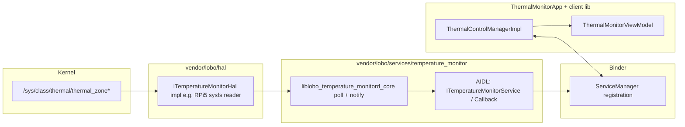
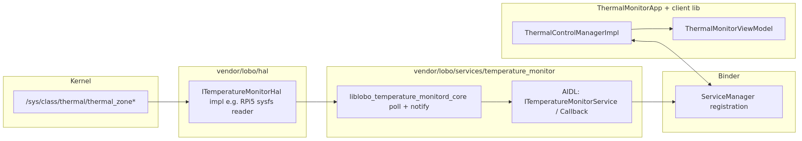
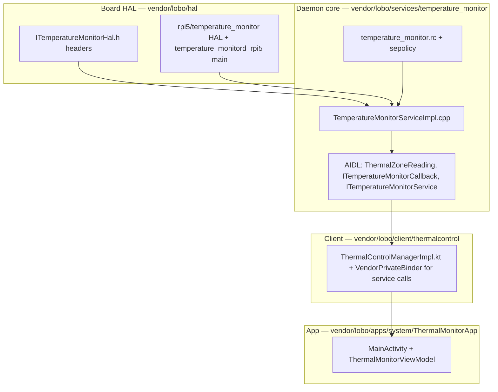
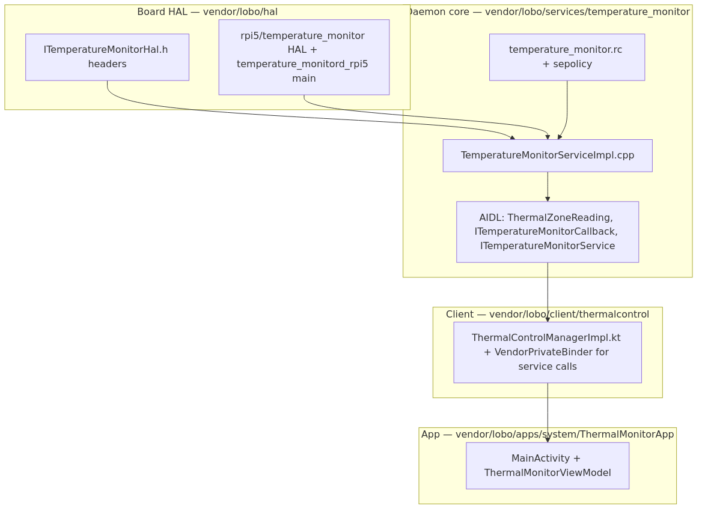
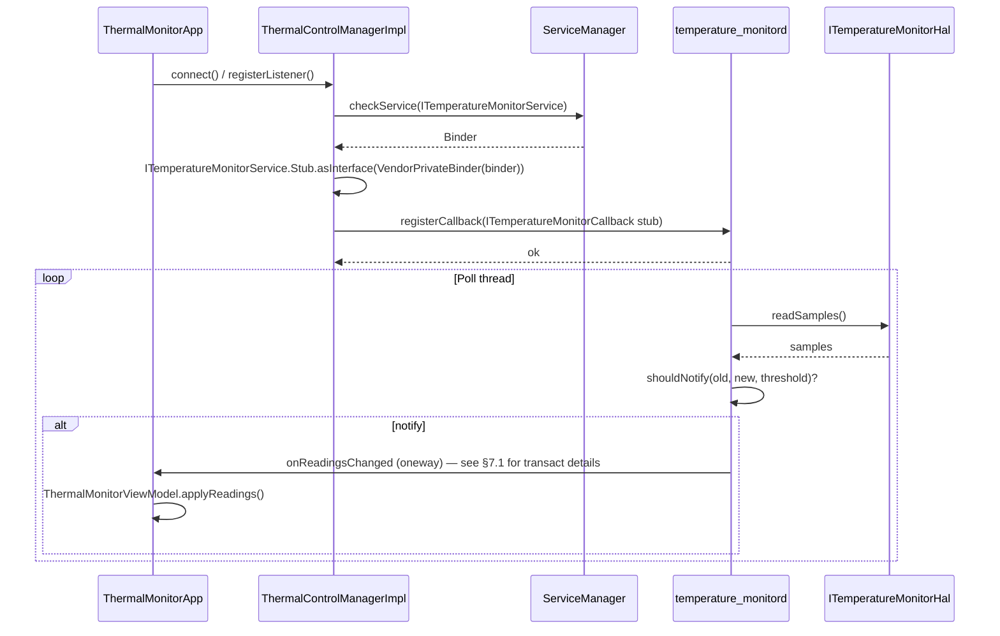
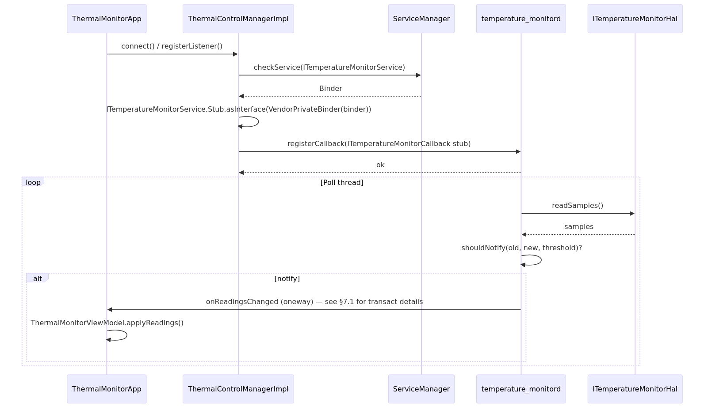
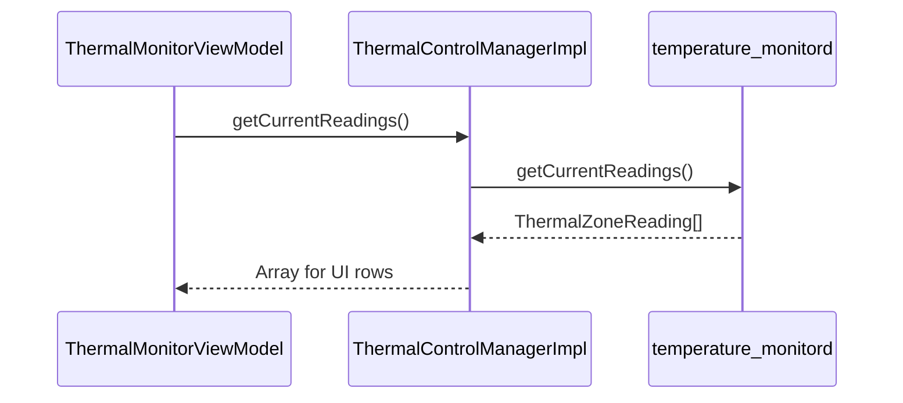
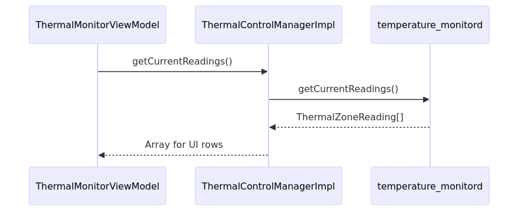

# Thermal functionality — end-to-end reference

**What:** A single reference for **how Lobo thermal monitoring works in practice**: components, Binder/AIDL interfaces, runtime sequences, verification, and **issues we hit during bring-up** (with fixes). It complements the design-focused `docs/THERMAL_MONITORING_ARCHITECTURE.md` with diagrams and operational detail.

**Why:** Onboarding and debugging thermal issues requires more than folder names—**Binder stability rules**, **one daemon invariant**, and **notify vs poll** semantics show up only when you integrate on device. This doc captures that so future changes do not repeat the same integration mistakes.

**How:** Read top-down for the architecture, use the **Interfaces** and **Sequence diagrams** when changing AIDL or the daemon, and use **Issues and resolutions** when logcat shows `onReadingsChanged failed`, `status=-32`, or misleading `fallback pull refresh` lines. Follow `docs/DOCUMENTATION_STYLE.md` (What / Why / How).

**Related docs:** `docs/THERMAL_MONITORING_ARCHITECTURE.md` (design contract), `docs/FOLDER_STRUCTURE_GUIDELINES.md`, `docs/PROJECT_GUIDE.md`.

**PNG figures:** The diagrams in this doc are also checked in as PNGs under `docs/images/thermal/` (same content as the Mermaid sources in `*.mmd` there). Use those files for slides, wikis, or viewers that do not render Mermaid.

---

## Table of contents

1. [System overview](#1-system-overview)
2. [Component diagram](#2-component-diagram)
3. [Interfaces](#3-interfaces)
4. [Sequence: connect, register, notify (callback path)](#4-sequence-connect-register-notify-callback-path)
5. [Sequence: pull snapshot (`getCurrentReadings`)](#5-sequence-pull-snapshot-getcurrentreadings)
6. [Notify semantics (daemon)](#6-notify-semantics-daemon)
7. [Issues encountered and how we solved them](#7-issues-encountered-and-how-we-solved-them)
8. [Operational checklist](#8-operational-checklist)
9. [Verification](#9-verification)

---

## 1. System overview

### What

Thermal monitoring on Lobo RPi5 products is implemented as a **vendor daemon** (`temperature_monitord`) that:

1. Reads temperatures via a **board HAL** (e.g. RPi5 sysfs under `/sys/class/thermal/`).
2. Exposes an **AIDL/Binder service** (`ITemperatureMonitorService`) on the **vendor** partition.
3. Pushes **on-change notifications** to registered clients via `ITemperatureMonitorCallback.onReadingsChanged` (oneway).
4. Serves **pull** snapshots via `getCurrentReadings()` for diagnostics and UI fallback.

Privileged apps (e.g. **ThermalMonitorApp**) use the **Java client library** `lobo-client-thermalcontrol-java` (`ThermalControlManager`) to talk to the same service.

### Why

- **One daemon + one SELinux domain** keeps sysfs access and policy in one place.
- **AIDL** gives a typed API for Java and NDK without ad-hoc sockets.
- **HAL under `vendor/lobo/hal/`** keeps board specifics out of `projects/*` product trees.

### How (high-level data path)

---

## 2. Component diagram

### What

Logical ownership of code and binaries (names are representative; exact Soong module names appear in `Android.bp` files).

### Why

Clear ownership avoids placing HAL code under `projects/` or duplicating Binder glue in every app.

### How

**Binary on device:** `/vendor/bin/temperature_monitord` (from `temperature_monitord_rpi5`, `stem: "temperature_monitord"`).

---

## 3. Interfaces

### What

The contracts between layers: C++ HAL header, AIDL surfaces, and the Java façade.

### Why

When debugging Binder, you must know **which interface** is registered in `ServiceManager` and **which direction** each transaction goes (app→daemon vs daemon→app).

### How — summary table

| Layer | Artifact | Role |
|--------|-----------|------|
| HAL | `vendor/lobo/hal/interfaces/include/lobo/platform/hal/ITemperatureMonitorHal.h` | Board-agnostic C++ API: read samples into `ThermalZoneSample`-like structures. |
| HAL impl | `vendor/lobo/hal/rpi5/temperature_monitor/` | RPi5 sysfs implementation linked into the board’s `cc_binary`. |
| AIDL parcelable | `ThermalZoneReading.aidl` | Zone name, temp (m°C), timestamp (ns). |
| AIDL callback | `ITemperatureMonitorCallback.aidl` | `oneway onReadingsChanged(ThermalZoneReading[] readings)`. |
| AIDL service | `ITemperatureMonitorService.aidl` | `getCurrentReadings`, `registerCallback` / `unregisterCallback`, poll interval + notify threshold getters/setters. |
| Service name | `com.lobo.platform.temperaturemonitor.ITemperatureMonitorService` | Registered by native `temperature_monitord` at startup. |
| Java client | `lobo-client-thermalcontrol-java` | `ThermalControlManager` → `ITemperatureMonitorService.Stub` via `VendorPrivateBinder` for **incoming** calls to the service. |

**Note:** The app uses `VendorPrivateBinder` when **calling into** the vendor service from Java (Treble-style flag). That is **separate** from the **outbound callback** transaction (daemon → app), which required a dedicated fix (see [§7.1](#71-vendor--app-callback-failed-exception--129)).

---

## 4. Sequence: connect, register, notify (callback path)

### What

End-to-end flow when **ThermalMonitorApp** starts, registers a listener, and receives push updates.

### Why

Most user-visible bugs appear in this path (`registerCallback`, `notify`, `onReadingsChanged`).

### How

---

## 5. Sequence: pull snapshot (`getCurrentReadings`)

### What

Synchronous read of the last cached samples in the daemon (no sysfs read on every call beyond what the poll loop already did).

### Why

Used for **initial UI fill**, **Apply settings** flows, and **fallback** if push updates are quiet.

### How

---

## 6. Notify semantics (daemon)

### What

The daemon thread periodically:

1. Reads fresh samples from the HAL.
2. Updates the **last snapshot** used for `getCurrentReadings()`.
3. Decides whether to **notify** registered callbacks based on **notify threshold** (milli-°C delta) and **first sample** rules (see `TemperatureMonitorServiceImpl.cpp`).

### Why

Without thresholding, every poll would spam callbacks; with thresholding, **gaps of several seconds with no callback** are **normal** when temperature is stable—this interacted badly with an old UI “stale” heuristic (see [§7.4](#74-misleading-fallback-pull-refresh-in-the-vm)).

### How

- Tune via `ITemperatureMonitorService` setters from the app (poll interval ms, notify threshold m°C).
- Interpret logs: `notify: zones=N callbacks=M threshold=T` — `M` is how many callbacks are registered **in that process**.

---

## 7. Issues encountered and how we solved them

### What

Binder integration issues that showed up in **`adb logcat`** during bring-up—not hypothetical.

### Why

These issues are easy to misread as “thermal broken” when they are actually **IPC stability**, **process duplication**, or **UI heuristics**.

### How — issue / symptom / fix

| # | Symptom | Root cause | Fix |
|---|---------|------------|-----|
| 7.1 | `onReadingsChanged failed: ... exception=-129` and `Cannot do a user transaction on a system stability binder ... in a vendor stability context` | Generated NDK `BpTemperatureMonitorCallback` ORs `FLAG_PRIVATE_VENDOR` when `BINDER_STABILITY_SUPPORT` is enabled. That makes `BpBinder` enforce a **vendor**-context transaction to a **system**-stability Java callback—**rejected**. | **Daemon:** send the oneway callback with **`AIBinder_transact(..., FLAG_ONEWAY)` only**, mirroring the AIDL parcel write path, in `TemperatureMonitorServiceImpl.cpp` (`transactOnReadingsChangedNoPrivateVendor`). Do not rely on the generated `cb->onReadingsChanged()` for vendor→app on this stack. |
| 7.2 | `onReadingsChanged failed: ... status=-32` (`STATUS_DEAD_OBJECT`) with **multiple** PIDs in logs | **Several** `temperature_monitord` processes (init + manual copies). Callbacks registered with one PID, notifies from another; stale binder tokens. | Ensure **exactly one** daemon: `adb root`, `stop temperature_monitord`, `killall -9 temperature_monitord`, verify **empty** `pidof`, then start **one** binary; avoid launching `/data/local/tmp/...` on top of a live init instance without stopping the service first. |
| 7.3 | `adb push` / `ls` fails on `out/.../temperature_monitord` from laptop | Build artifacts live under **`/root/...` on the build server**; laptop user cannot read that path. | Copy artifact to laptop (**FileZilla/scp**), then `adb push` from laptop; or run `adb` **on the server** if USB is there (usually not). |
| 7.4 | `ThermalMonitorVM: fallback pull refresh: no callback in >5s` while **`callback: zones=...`** also appears | **False positive:** daemon may **skip notify** when delta &lt; threshold for &gt;5s; UI treated “no callback” as failure. | **App:** track **any** zones update time (`lastZonesUpdateAtMs`), use a longer **stale** window (e.g. 15s), refresh timestamp on initial pull and after fallback—see `ThermalMonitorViewModel.kt`. |
| 7.5 | `Service ... not found` / HMI “not available” | Daemon not running or not registered after experiments. | `adb shell start temperature_monitord` or reboot; verify `service list` and `pidof`. |

---

## 8. Operational checklist

### What

Practical rules when testing or demoing thermal on hardware.

### Why

Violating these produces confusing logs that look like Binder bugs.

### How

1. **One `temperature_monitord` process** when debugging callbacks (see §7.2).
2. **Client app → service:** keep using **`VendorPrivateBinder`** for `ITemperatureMonitorService` calls from Java (existing `ThermalControlManagerImpl`).
3. **Daemon → app callback:** implemented via **manual transact** without private-vendor flag on the callback transaction (§7.1)—do not “fix” by re-enabling generated `Bp` callback blindly on vendor→system without re-checking `BpBinder` stability rules.
4. **Deploy:** iterative test can use `/data/local/tmp/temperature_monitord_new`; production uses **`/vendor/bin/temperature_monitord`** inside `vendor.img` / OTA.

---

## 9. Verification

### What

Commands to confirm daemon, service, callbacks, and UI.

### Why

Separates **daemon down**, **service not registered**, **callback broken**, and **UI-only** issues.

### How

Follow **`docs/THERMAL_MONITORING_ARCHITECTURE.md` §11** (runtime verification), including:

- `pidof` / `ps -Z` for `temperature_monitord`
- `service list | grep ITemperatureMonitorService`
- Log greps for `ThermalCtrlMgr`, `ThermalMonitorVM`, `temperature_monitord`, `onReadingsChanged failed`
- For callback health after fixes: `adb logcat` should show **`ThermalMonitorVM: callback: zones=...`** when pushes arrive

---

## Document history

| Date | Change |
|------|--------|
| 2026-03-31 | Initial version: diagrams, interfaces, sequences, issue table (Binder callback stability, multi-daemon, deploy paths, VM fallback heuristic). |
| 2026-03-31 | Added `docs/images/thermal/*.png` (and matching `*.mmd`) for PNG exports of the Mermaid diagrams; doc links to PNGs below each diagram. |

**Author:** Francis Lobo · **Project:** lobo-aosp-platform
