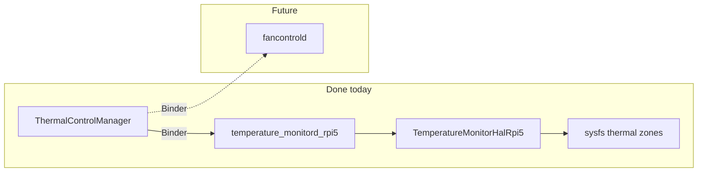

# Thermal monitoring architecture

**What:** This document defines the intended architecture for **thermal monitoring** on Lobo AOSP: where the board-agnostic C++ contract lives, where Raspberry Pi 5–specific code belongs, how a dedicated vendor daemon exposes readings and **notify-on-change** behavior to clients, and how this relates to future fan control. It is a **design reference**; implementation may lag this document.

**Why:** Thermal data is shared by multiple consumers (policy, UI, automation). Without a single contract and a clear split between **portable interface** and **board-specific implementation**, headers drift across trees, Soong graphs become fragile, and SELinux policies are hard to reason about. This layout (Option B) keeps one canonical HAL-style interface under `lobo/platform/hal/`, puts RPi5-only sysfs and tuning under `vendor/lobo/hal/rpi5/`, and mirrors patterns already used elsewhere in the platform (see `docs/CALCULATOR_SERVICE.md` for Binder + AIDL + vendor daemon).

**How:** Use this document when adding modules, reviewing `Android.bp` graphs, or wiring products (`device.mk`, `init` `.rc`, sepolicy). Each major section below follows **What / Why / How** per `docs/DOCUMENTATION_STYLE.md`.

**Related docs:** `docs/FOLDER_STRUCTURE_GUIDELINES.md`, `docs/PROJECT_GUIDE.md`, `docs/CALCULATOR_SERVICE.md`, `docs/THERMAL_FUNCTIONALITY.md` (diagrams, sequences, issues & fixes).

---

## Table of contents

1. [Goals and non-goals](#1-goals-and-non-goals)
2. [Layering: HAL, daemon, Binder, clients](#2-layering-hal-daemon-binder-clients)
3. [Option B: directory and naming layout](#3-option-b-directory-and-naming-layout)
4. [Data model and notification semantics](#4-data-model-and-notification-semantics)
5. [Build and integration outline](#5-build-and-integration-outline)
6. [Multi-target strategy](#6-multi-target-strategy)
7. [Relationship to fan control](#7-relationship-to-fan-control)
8. [Security and policy touchpoints](#8-security-and-policy-touchpoints)
9. [Java/Kotlin client library placement](#9-javakotlin-client-library-placement)
10. [Repository tree and implementation status](#10-repository-tree-and-implementation-status)
11. [Runtime verification steps](#11-runtime-verification-steps)

---

## 1. Goals and non-goals

### What

- **Goals:** Provide stable **CPU (and optionally other zone) temperatures** to the system; support **subscription-style updates** when readings change meaningfully; keep the **interface** in one repo location independent of any single device tree; keep **RPi5 sysfs paths and quirks** out of generic code.
- **Non-goals (for this subsystem as specified here):** Owning fan PWM policy end-to-end (that remains a separate concern; see [§7](#7-relationship-to-fan-control)); replacing Android’s framework thermal HAL where the product already uses one—this design is **Lobo’s vendor-side** stack unless product owners choose to consolidate.

### Why

- A **single interface** avoids duplicating `ITemperatureMonitorHal`-style headers under each `projects/*` tree.
- A **dedicated daemon** gives one SELinux domain, one init entry, and one place to implement poll intervals, thresholds, and debouncing without coupling to UI or unrelated services.

### How

- When implementing, treat this doc as the **naming and ownership** contract: new files go under the paths in [§3](#3-option-b-directory-and-naming-layout); product wiring follows [§5](#5-build-and-integration-outline).

---

## 2. Layering: HAL, daemon, Binder, clients

### What

Conceptual stack (bottom to top):

| Layer | Responsibility |
|--------|------------------|
| **Board implementation** | Reads hardware-specific sources (on RPi5, typically sysfs thermal zones). Implements `ITemperatureMonitorHal` (or equivalent abstract API). |
| **Vendor daemon** | Long-lived process: owns the HAL implementation instance, periodic sampling, change detection, and Binder registration. |
| **AIDL / Binder** | Stable API for system or privileged clients (Java/Kotlin or native) to register callbacks and query snapshots. |
| **Clients** | Settings UI, automation, or other vendor apps granted permission to bind. |

### Why

- **HAL as a C++ boundary** keeps testable, linkable logic without dragging in Binder headers in the lowest layer if you prefer a thin abstract class.
- **Binder at the daemon edge** matches Android’s standard IPC model and aligns with `calculatord`-style modules already in the repo.

### How

- Follow the same **service module** pattern as `vendor/lobo/services/calculator/` for `Android.bp`, `*.rc`, AIDL package layout, and optional `sepolicy/` next to the daemon—adapt names to `temperature_monitord` (or the name chosen at implementation time).
- Native clients may use NDK Binder; Java clients use generated AIDL stubs, as described in `CALCULATOR_SERVICE.md`.

---

## 3. Option B: directory and naming layout

### What

**Option B** (chosen naming alignment):

- **Canonical C++ interface (board-agnostic):**  
  Header path such as **`lobo/platform/hal/ITemperatureMonitorHal.h`** — exactly **one** include root for this contract in the platform tree (delivered via a `cc_library_headers` module, e.g. `liblobo_temperature_monitor_hal_headers`).

- **Raspberry Pi 5 implementation only:**  
  Under **`vendor/lobo/hal/rpi5/temperature_monitor/`** (with `include/` and `src/` as appropriate), containing code that knows sysfs paths, scaling, and any RPi5-specific limits.

- **Vendor daemon core (Binder + AIDL, board-agnostic):**  
  Under **`vendor/lobo/services/temperature_monitor/`** — AIDL, `liblobo_temperature_monitord_core` (polling, callbacks, `Run.cpp`), `*.rc`, sepolicy. This module **does not** link a board HAL.

- **Per-board daemon entry (thin `main` + link line):**  
  Under **`vendor/lobo/hal/<board>/temperature_monitor/`** next to that board’s HAL — e.g. **`temperature_monitord_rpi5`** with **`stem: "temperature_monitord"`** so the installed binary is always **`/vendor/bin/temperature_monitord`**, while the Soong module name stays unique per board. Khadas VIM3 adds **`temperature_monitord_vim3`** (same stem) under **`vendor/lobo/hal/vim3/temperature_monitor/`** and links **`liblobo_temperature_monitor_hal_vim3`** instead of the RPi5 static library.

Illustrative tree:

```
lobo-aosp-platform/vendor/lobo/
├── hal/
│   ├── interfaces/
│   │   └── include/lobo/platform/hal/ITemperatureMonitorHal.h
│   └── rpi5/
│       └── temperature_monitor/       # RPi5 sysfs HAL + RPi5-specific cc_binary
│           ├── Android.bp             # liblobo_temperature_monitor_hal_rpi5 + temperature_monitord_rpi5
│           ├── main.cpp
│           ├── include/...
│           └── src/...
└── services/
    └── temperature_monitor/           # AIDL + liblobo_temperature_monitord_core (no board HAL)
        ├── Android.bp
        ├── temperature_monitor.rc
        ├── aidl/...
        └── cpp/...
```

Exact folder names under `hal/interfaces` are an implementation detail; the **invariant** is: **one** published include path `lobo/platform/hal/...` for the interface, **one** board subtree per hardware under `hal/<board>/temperature_monitor/`, and **one** daemon core in `services/temperature_monitor/` that all boards reuse.

### Why

- **Interfaces in `vendor/lobo`** stay on the bind-mounted tree Soong already scans—no need to put the generic header only under `projects/rpi5_custom`, which would imply the contract is RPi-specific.
- **`hal/rpi5/`** groups future board-specific HALs (fan, thermal, etc.) under a predictable prefix for reviewers and ownership.

### How

- **`PRODUCT_PACKAGES`** lists the board-specific module for that product (e.g. **`temperature_monitord_rpi5`** on RPi5). VIM3 products list **`temperature_monitord_vim3`** when that module exists. Init and sepolicy still reference **`/vendor/bin/temperature_monitord`** (via `stem`).
- Put board HAL + board `cc_binary` under **`vendor/lobo/hal/<board>/`** so every AOSP tree that bind-mounts `vendor/lobo` sees the same Soong modules; avoid putting the only copy of `temperature_monitord_*.bp` under **`projects/<one_product>/`**, because only one `projects/*` tree is mounted per lunch target.
- Device projects (`projects/rpi5_custom`, `projects/rpi5_custom_car`) supply **product** wiring—`device.mk`, `init` scripts—not copies of `ITemperatureMonitorHal.h`.

---

## 4. Data model and notification semantics

### What

- **Snapshot:** Structured fields at minimum: timestamp, zone id or name, temperature in a fixed unit (e.g. millidegrees Celsius or float Celsius—**pick one at implementation** and document in AIDL).
- **Notify-on-change:** The daemon polls sysfs (or other backends) on a configurable interval; it compares readings against **threshold** and **hysteresis/debounce** rules so clients are not flooded. On meaningful change, it invokes registered **AIDL callbacks** (push). Clients may also **pull** the latest snapshot on demand.

### Why

- Sysfs does not deliver edge-triggered interrupts to a simple file poll in a portable way; **level-triggered polling with internal filtering** is robust and testable.
- **Thresholds** let the UI show “warm” vs “hot” without exposing every 1 °C jitter.

### How

- Implement polling and comparison in the daemon (or a small library used only by the daemon), not in each client.
- Expose subscription limits (max callbacks, rate limit) if untrusted clients could bind—policy in [§8](#8-security-and-policy-touchpoints).

---

## 5. Build and integration outline

### What

- **Soong:** `cc_library_headers` for the interface; `cc_library_static` or `cc_library_shared` for RPi5 thermal HAL; `cc_binary` for the daemon; `aidl_interface` for the API; optional `vts`/`gtest` targets.
- **Product:** `PRODUCT_PACKAGES` includes the daemon; `device.mk` (or inherited makefiles) pulls in sepolicy fragments.
- **Init:** A `service ... /vendor/bin/...` block in the product’s `init` `.rc` (e.g. under `projects/*/init/hw/`) starts the daemon in the appropriate class.
- **SELinux:** Dedicated `*.te` for the daemon domain, `service_contexts` for the Binder service name, `file_contexts` for the binary.

### Why

- Matches **FOLDER_STRUCTURE_GUIDELINES** for vendor services and keeps all artifacts discoverable from one module root.

### How

- Use `docs/CALCULATOR_SERVICE.md` as the **concrete** example for AIDL placement, `service.te`, and `adb` verification commands; substitute thermal module names and service interface methods.

**Verify (once implemented):**

```bash
# Example checks — adjust service name when implemented
adb shell getprop | grep -i thermal
adb shell dumpsys activity service <ThermalMonitorService>   # if registered with ServiceManager
adb shell lshal | grep -i lobo
```

---

## 6. Multi-target strategy

### What

- **RPi5:** Implementation under `vendor/lobo/hal/rpi5/temperature_monitor/`.
- **Future boards (e.g. VIM3):** Add `vendor/lobo/hal/<board>/temperature_monitor/` (or shared IP when sensors align) **without** renaming `lobo/platform/hal/ITemperatureMonitorHal.h`.

### Why

- The **interface** is the stable ABI for the vendor daemon; board folders are **swappable** at link time or via product variables.

### How

- Product makefiles select which `cc_library` implements the HAL for that lunch target.

---

## 7. Relationship to fan control

### What

- **Thermal monitoring** reports **state** (temperatures, optionally trends).
- **Fan control** applies **actuation** (PWM curves, user overrides). It may **consume** thermal readings but should not duplicate the sysfs thermal reader in a second daemon if one thermal authority is desired.

### Why

- Separating **sense** and **actuate** keeps SELinux and failure domains clear: a bug in PWM logic should not necessarily kill temperature readout for safety UI.

### How

- Inter-service communication can be a second AIDL, shared memory, or direct library link **only** inside vendor code—decide at implementation time; document the chosen IPC in a short addendum or in code comments next to the interface.

---

## 8. Security and policy touchpoints

### What

- Daemon runs as a dedicated **vendor** uid; sysfs access requires **explicit** `allow` rules for paths used on RPi5.
- Binder API should be **permission-gated** or restricted to `system` / `privileged` apps as product requirements dictate.

### Why

- Thermal data can inform side channels; actuation APIs are sensitive. Policy must be **explicit** in `sepolicy/` shipped with the service.

### How

- Follow the same sepolicy layout as `vendor/lobo/services/calculator/cpp/sepolicy/`; extend for `sysfs` reads and any `hwbinder` / `binder` use.

---

## 9. Java/Kotlin client library placement

### What

Where to put the app-facing Binder façade (e.g. **`ThermalControlManager`**) that registers **`ITemperatureMonitorCallback`**, exposes readings to UI code—**without** sysfs and **without** a ViewModel polling loop—and (later) talks to **`fancontrold`** as well.

### Why

Folder layout must match **`docs/FOLDER_STRUCTURE_GUIDELINES.md`**: there is **no** valid tree `vendor/lobo/common/java/<feature>/` (no top-level **`common/java/`** bucket). **`common/<feature>/`** is for **shared primitives** (logger, types, fan_math). A **`ThermalControlManager`** that binds to **two** vendor daemons (`temperature_monitord` **and** future `fancontrold`) is **app–service glue**, not a generic common util—put it under **`vendor/lobo/client/<feature>/java/`** so one library can depend on **both** AIDL Java stubs without living under a single `services/temperature_monitor/` tree.

### How

- **Recommended for `ThermalControlManager` (thermal + fan):**  
  **`vendor/lobo/client/thermalcontrol/java/src/main/java/...`**  
  One `java_library` module (**`lobo-client-thermalcontrol-java`**) that statically links **`lobo_temperature_monitor_aidl-java`** and, when it exists, **`lobo_fan_control_aidl-java`**. Package **`com.lobo.platform.client.thermalcontrol`** with **`api/`** / **`impl/`**. **Not** `vendor/lobo/common/java/thermalcontrol/` (invalid) and **not** under **`common/thermalcontrol/`** (reserve **`common/`** for logger, types, etc.). Entry point: **`ThermalControlManagers.create()`** in **`impl/`** (thermal IPC today; extend for fan when **`fancontrold`** ships).
- **Optional thermal-only helper:** a thin client **only** for `temperature_monitord` may live under **`vendor/lobo/services/temperature_monitor/java/...`** (§4 of the folder guidelines); most products that plan a **single** façade can skip this and use **`client/thermalcontrol`** from the start.
- **Daemons stay separate:** `temperature_monitord` and `fancontrold` remain under **`vendor/lobo/services/temperature_monitor/`** and **`vendor/lobo/services/fan_control/`** with their own **sepolicy**; the **client library** runs in the **app** process (no separate domain for the `.jar`).
- Cross-reference: **`docs/FOLDER_STRUCTURE_GUIDELINES.md`** ( **`client/`** vs **`common/`** ) and §4 (service-scoped `java/` when the client is single-service only).

---

## 10. Repository tree and implementation status

### What

A **frozen** view of directories and key files under **`lobo-aosp-platform`**, with a **status** for each major piece: already present in the repo, planned next, or future (not in tree yet).

### Why

Onboarding and reviews should not need to re-derive “what exists” from scattered `Android.bp` files. This section is the **single checklist** against the architecture in [§3](#3-option-b-directory-and-naming-layout) and [§9](#9-javakotlin-client-library-placement).

### How

Use the **legend** when reading the tree. For product wiring, compare your lunch target to **`projects/rpi5_custom/`** and **`projects/rpi5_custom_car/`** (`device.mk`, `BoardConfig.mk`, `init/hw/init.rpi5.rc`).

**Legend**

| Tag | Meaning |
|-----|--------|
| **Done** | Present in `lobo-aosp-platform` and wired for RPi5 products where noted |
| **Planned** | Agreed layout; not yet added (e.g. fan stack or optional thermal-only helper under `services/`) |
| **Future** | Out of scope for this snapshot; no `vendor/lobo` tree yet |

**Tree (paths relative to `lobo-aosp-platform/`)**

```
vendor/lobo/
├── hal/
│   ├── interfaces/                                    [Done]
│   │   ├── Android.bp                                   # liblobo_temperature_monitor_hal_headers
│   │   └── include/lobo/platform/hal/
│   │       └── ITemperatureMonitorHal.h
│   │
│   └── rpi5/
│       └── temperature_monitor/                         [Done — RPi5 HAL + per-board daemon binary]
│           ├── Android.bp                               # temperature_monitord_rpi5, liblobo_temperature_monitor_hal_rpi5
│           ├── main.cpp
│           ├── include/lobo/platform/hal/rpi5/
│           │   └── TemperatureMonitorHalRpi5.h
│           └── src/
│               └── TemperatureMonitorHalRpi5.cpp
│
├── services/
│   ├── temperature_monitor/                           [Done — AIDL, core, sepolicy, init rc]
│   │   ├── Android.bp                                 # lobo_temperature_monitor_aidl, liblobo_temperature_monitord_core
│   │   ├── temperature_monitor.rc
│   │   ├── aidl/com/lobo/platform/temperaturemonitor/
│   │   │   ├── ThermalZoneReading.aidl
│   │   │   ├── ITemperatureMonitorCallback.aidl
│   │   │   └── ITemperatureMonitorService.aidl
│   │   ├── cpp/core/
│   │   │   ├── include/lobo/platform/temperaturemonitor/
│   │   │   └── src/ (TemperatureMonitorServiceImpl.cpp, Run.cpp)
│   │   └── sepolicy/ (temperature_monitord.te, service.te, file_contexts, service_contexts)
│   │
│   └── fan_control/  (name TBD)                         [Future — fancontrold, fan AIDL, sepolicy]
│       └── …
│
├── client/
│   └── thermalcontrol/                                  [Done — lobo-client-thermalcontrol-java; see §9]
│       ├── Android.bp
│       └── java/src/main/java/com/lobo/platform/client/thermalcontrol/
│           ├── api/ (ThermalControlManager, ThermalReadingsListener)
│           └── impl/ (ThermalControlManagerImpl, ThermalControlManagers, VendorPrivateBinder)
│
└── common/                                              [logger, fan_math, types — not thermal glue]
    └── …

projects/
├── rpi5_custom/                                         [Done — PRODUCT_PACKAGES, rc copy, sepolicy, init import]
│   ├── device.mk
│   ├── BoardConfig.mk
│   └── init/hw/init.rpi5.rc
└── rpi5_custom_car/                                     [Done — same pattern as rpi5_custom]
    ├── device.mk
    ├── BoardConfig.mk
    └── init/hw/init.rpi5.rc
```

**Future board example (not in repo until VIM3):** `vendor/lobo/hal/vim3/temperature_monitor/` — same pattern as RPi5; **`stem: "temperature_monitord"`** on the board `cc_binary` (see [§3](#3-option-b-directory-and-naming-layout)).

**Status table**

| Piece | Status | Notes |
|--------|--------|--------|
| `ITemperatureMonitorHal` + `liblobo_temperature_monitor_hal_headers` | **Done** | `hal/interfaces/` |
| RPi5 `TemperatureMonitorHalRpi5` + `liblobo_temperature_monitor_hal_rpi5` | **Done** | `hal/rpi5/temperature_monitor/` |
| `temperature_monitord_rpi5` → `/vendor/bin/temperature_monitord` | **Done** | `stem: "temperature_monitord"` |
| `liblobo_temperature_monitord_core` + NDK AIDL | **Done** | `services/temperature_monitor/` |
| `lobo_temperature_monitor_aidl` **Java** backend | **Done** | `sdk_version: "current"` in `services/temperature_monitor/Android.bp` |
| **`ThermalControlManager`** (`lobo-client-thermalcontrol-java`) | **Done** | Thermal IPC only; add **`lobo_fan_control_aidl-java`** to that module when fan exists |
| **fancontrold** + fan HAL + fan AIDL | **Future** | Not under `vendor/lobo/services/` in this snapshot |
| **`rpi5_custom` / `rpi5_custom_car`** product wiring | **Done** | `temperature_monitord_rpi5`, rc, sepolicy dir, `init` import |

**Relationships (today vs planned façade)**



---

## Document history

| Date | Change |
|------|--------|
| 2026-03-28 | Initial publication: Option B layout, layering, notification model, integration outline. |
| 2026-03-28 | Multi-target: daemon core vs per-board `temperature_monitord_<board>` under `hal/<board>/temperature_monitor/`. |
| 2026-03-29 | §9: Java/Kotlin client (`ThermalControlManager`) paths; cross-ref to folder guidelines (`common/java/` anti-pattern). |
| 2026-03-29 | §9: (Earlier) `vendor/lobo/common/thermalcontrol/` — **superseded** by `vendor/lobo/client/thermalcontrol/`. |
| 2026-03-29 | §10: Frozen repo tree + status table + legend; mermaid for ThermalControlManager vs daemons. |
| 2026-03-29 | Implement thermal Java client + AIDL (module later renamed **`lobo-client-thermalcontrol-java`**); §10 tree/status/mermaid updated. |
| 2026-03-29 | Move thermal glue to `vendor/lobo/client/thermalcontrol/`; module `lobo-client-thermalcontrol-java`; package `com.lobo.platform.client.thermalcontrol`. |

**Author:** Francis Lobo · **Project:** lobo-aosp-platform

---

## 11. Runtime verification steps

### What

Step-by-step `adb` checks to verify **end-to-end thermal monitoring**:
`temperature_monitord` -> Binder/AIDL service -> `ThermalMonitorApp` MVVM UI.

### Why

After flashing or SELinux/policy changes, thermal failures can be silent (UI shows nothing, daemon still runs, Binder connection may or may not work). This checklist confirms:
- the daemon is running,
- the Binder service is registered,
- the app connects successfully,
- the UI actually renders non-empty zone readings,
- the underlying `/sys/class/thermal/thermal_zone*` nodes exist and have data.

### How

#### Preconditions

1. Device is booted and visible over ADB:
```bash
adb wait-for-device
adb devices -l
```

2. (Optional but recommended) Check SELinux mode so you can interpret denials:
```bash
adb shell getenforce
```

#### 1) Verify daemon is alive

```bash
adb shell pidof -s temperature_monitord
adb shell ps -Z | grep -F "temperature_monitord"
```

You should see `temperature_monitord` running under SELinux domain:
`u:r:temperature_monitord:s0`.

**Expected output examples**
- `adb shell pidof -s temperature_monitord` prints a PID (e.g. `318`)
- `adb shell ps -Z | grep -F temperature_monitord` contains:
  `u:r:temperature_monitord:s0    system  <pid> ... temperature_monitord`

#### 2) Verify Binder service is registered

`ThermalControlManagerImpl` connects to:
`com.lobo.platform.temperaturemonitor.ITemperatureMonitorService`.

```bash
adb shell service list | grep -F "com.lobo.platform.temperaturemonitor.ITemperatureMonitorService"
```

**Expected output examples**
- A line containing:
  `com.lobo.platform.temperaturemonitor.ITemperatureMonitorService`

#### 3) Start the ThermalMonitorApp and confirm Binder connect

Clear logcat, force-stop the app, then start its main activity:

```bash
adb logcat -c
adb shell am force-stop com.lobo.platform.thermalmonitor.client
adb shell am start -W -n com.lobo.platform.thermalmonitor.client/.ui.MainActivity
```

Now check for the client-side connect success signal (tag `ThermalCtrlMgr`):

```bash
adb logcat -d -v time | grep -F "ThermalCtrlMgr" | tail -50
```

Expected:
- a line like `binder ok, using FLAG_PRIVATE_VENDOR wrapper for com.lobo.platform.temperaturemonitor.ITemperatureMonitorService`
- no `Service ... not found` from `ThermalControlManagerImpl`.

**Expected output example**
- `I/ThermalCtrlMgr(...): binder ok, using FLAG_PRIVATE_VENDOR wrapper for com.lobo.platform.temperaturemonitor.ITemperatureMonitorService`

#### 3.1) Replace daemon binary and retest callback delivery

**What:** When you rebuild `temperature_monitord`, replace the running on-device daemon binary
and retest whether Binder callbacks deliver to the app (`onReadingsChanged`).

**Why:** Without restarting the daemon, your UI may still be connected to the old binary.
This avoids false negatives when you are testing callback delivery changes.

**How:**
```bash
adb root
adb remount

# Stop daemon cleanly
adb shell stop temperature_monitord 2>/dev/null || true

# Push the newly built binary
adb push out/target/product/rpi5_custom_car/vendor/bin/temperature_monitord /vendor/bin/temperature_monitord

# Fix perms + SELinux label (safe even in permissive)
adb shell chmod 0755 /vendor/bin/temperature_monitord
adb shell restorecon -v /vendor/bin/temperature_monitord 2>/dev/null || true

# Start daemon again
adb shell start temperature_monitord

# Restart app + collect logs
adb logcat -c
adb shell am force-stop com.lobo.platform.thermalmonitor.client
adb shell am start -W -n com.lobo.platform.thermalmonitor.client/.ui.MainActivity
sleep 15

adb logcat -d -v time | grep -E "onReadingsChanged failed|fallback pull refresh|registerCallback|notify:"
```

**Expected (callback working):**
- no `onReadingsChanged failed: ... exception=-129` lines
- `registerCallback: ... callbacks=1` followed by `notify: zones=... callbacks=1`
- `fallback pull refresh: no callback in >5s` is absent or at least not continuous

If you still see `onReadingsChanged failed`, the monitoring UI may still show temperatures via
the app-side fallback polling path, but push-delivered updates are not reliable yet.

#### 4) Verify the UI shows live zone readings

Dump the UI hierarchy and inspect `status_text` + `zones_text`:

```bash
adb shell uiautomator dump /sdcard/window_dump.xml
adb pull /sdcard/window_dump.xml window_dump.xml
grep -F "resource-id=\"com.lobo.platform.thermalmonitor.client:id/status_text\"" -n window_dump.xml | tail -5
grep -F "resource-id=\"com.lobo.platform.thermalmonitor.client:id/zones_text\"" -n window_dump.xml | tail -5
```

Expected:
- `status_text` shows `Connected.`
- `zones_text` is non-empty and includes lines such as:
  `cpu-thermal: <number> m°C  (t=<number> ns)`

**Expected output examples**
- `... status_text ... text="Connected." ...`
- `... zones_text ... text="cpu-thermal: 44650 m°C  (t=...)"`

If `status_text` is `Not connected...` or `zones_text` is empty, the daemon read/push path isn’t delivering readings (or the service connection failed).

#### 5) Verify sysfs thermal nodes exist and have values

```bash
adb shell ls /sys/class/thermal/thermal_zone* 2>/dev/null || true
adb shell 'for z in /sys/class/thermal/thermal_zone*; do echo "== $z =="; cat "$z/type" "$z/temp" 2>/dev/null; done'
```

Expected:
- `/sys/class/thermal/thermal_zone0/type` exists
- `/sys/class/thermal/thermal_zone0/temp` returns an integer (millidegrees Celsius on this stack).

**Expected output examples**
- `== /sys/class/thermal/thermal_zone0 ==`
- `cpu-thermal`
- a numeric temperature in the `temp` line, e.g. `44100`

In this stack:
- `temp` is typically **millidegrees Celsius** (so `44100` means `44.1°C`)
- the app UI should show the same magnitude (minor drift is normal between reads).

#### 6) Optional: check for daemon-specific SELinux denials

If you are testing with `getenforce` = `Enforcing`, look for denials from the daemon domain:

```bash
adb logcat -d -v time | grep -i avc | grep -F "scontext=u:r:temperature_monitord" | tail -100
```

If the policy is correct, this should be empty or minimal.

**Expected output examples**
- no `avc: denied ... scontext=u:r:temperature_monitord`
- or only very few benign denials depending on your base image

---

**Verification criteria (quick):**
- `temperature_monitord` is running
- `service list` contains `ITemperatureMonitorService`
- `ThermalCtrlMgr` shows `binder ok`
- UI `status_text` is `Connected.`
- UI `zones_text` includes at least one `m°C` line
